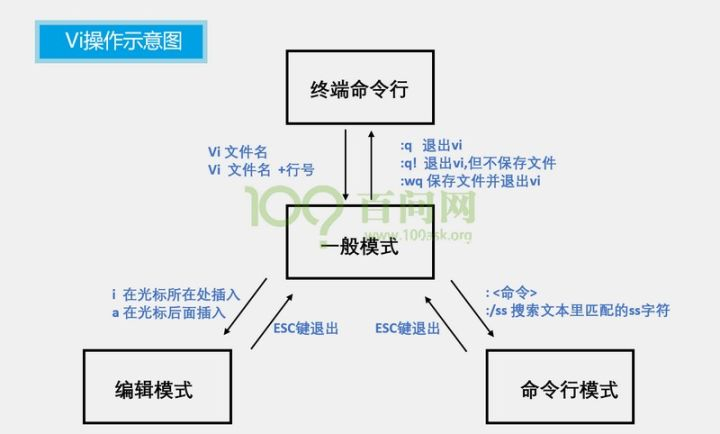
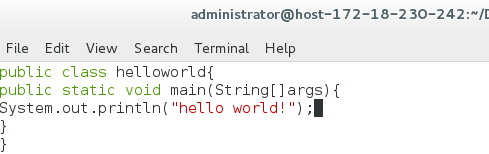
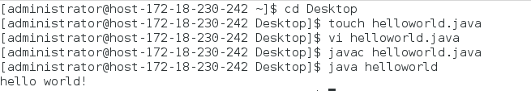

# 任务
## 1.学习vi/vim 编辑器的使用
   1）vi的启动 
      文件存在：进入文件所在目录:cd + 文件目录；vi + 文件名 
      文件不存在：系统会自动创建一个以该字符串命名的文本文件 
      另外以只读模式读取文件： 
  >$ vi –R example.c 以只读方式打开文件
  

  
   2）vi的工作模式 
   3种工作模式：普通模式、编辑模式和命令模式,相互之间可以切换
   
   常用相关命令： 
   >退出：
   >>:wq    文件保存退出 
   >>:q!    强制退出，文件不保存
   
   >编辑文件：
   >>在一般模式输入： 
   >>i(在光标前开始插入文本) 
   >>a(在光标后开始插入文本) 
   >>o(在当前行之下新开一行，并到行首) 

   >
   >光标移动：在一般模式下，hjkl这四个按键就可以移动光标
   >>h (左) j (下) k (上) l (右)
   >
   
   >  删除（可在操作前加数字表示删除多个）： 
  >>x ——删除光标后的一个字符 
  >>X ——删除光标前的一个字符 
  >>dd ——删除光标所在行 
 
>撤销：
>>u ——撤销上一次操作
## 熟悉JDK的环境并学习JAVA语言，完成HelloWorld的编译运行
由于JDK环境已经配置好，直接进行编译运行java程序，程序与步骤如下：

实验步骤及结果

## 熟悉Ant的环境并学习Ant，利用Ant实现HelloWorld的自动编译
   根据TA给的教程配置ant环境变量，基本没什么问题（不过就是考虑下环境变量位置就行）
   
## 学习Java语言，并编写Java小程序，完成要求请参考Java小程序完成要求
## 学习Junit，利用Ant、Junit测试通过HelloWorld
## 学习并配置SonarQube，利用SonarQube测试自己昨天写的Java小程序
## 将代码打包，上传至Matrix
## 完成GridWorld的环境配置，学习gridworld.jar的引用，编译运行BugRunner