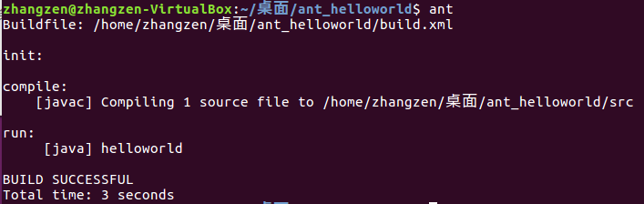
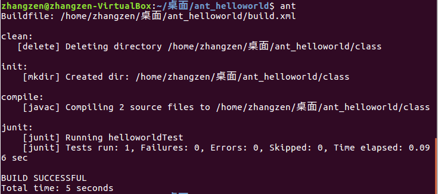

# 任务
## 1.学习vi/vim 编辑器的使用
   1）vi的启动 
      文件存在：进入文件所在目录:cd + 文件目录；vi + 文件名 
      文件不存在：系统会自动创建一个以该字符串命名的文本文件 
      另外以只读模式读取文件： 
  >$ vi –R example.c 以只读方式打开文件
  

  
   2）vi的工作模式 
   3种工作模式：普通模式、编辑模式和命令模式,相互之间可以切换
   
   常用相关命令： 
   >退出：
   >>:wq    文件保存退出 
   >>:q!    强制退出，文件不保存
   
   >编辑文件：
   >>在一般模式输入： 
   >>i(在光标前开始插入文本) 
   >>a(在光标后开始插入文本) 
   >>o(在当前行之下新开一行，并到行首) 

   >
   >光标移动：在一般模式下，hjkl这四个按键就可以移动光标
   >>h (左) j (下) k (上) l (右)
   >
   
   >  删除（可在操作前加数字表示删除多个）： 
  >>x ——删除光标后的一个字符 
  >>X ——删除光标前的一个字符 
  >>dd ——删除光标所在行 
 
>撤销：
>>u ——撤销上一次操作
## 熟悉JDK的环境并学习JAVA语言，完成HelloWorld的编译运行
由于JDK环境已经配置好，直接进行编译运行java程序，程序与步骤如下：

实验步骤及结果

* java学习 
>>基本语法： 
大小写敏感：Java 是大小写敏感的，这就意味着标识符 Hello 与   hello 是不同的。 
类名：对于所有的类来说，类名的首字母应该大写。 
方法名：所有的方法名都应该以小写字母开头。 
主方法入口：所有的 Java 程序由 public static void main(String []args) 方法开始执行。 
>>

>>Java对象和类：
   Java作为一种面向对象语言。支持以下基本概念：多态,继承,封装
,抽象,类,对象,实例,方法,重载.

## 熟悉Ant的环境并学习Ant，利用Ant实现HelloWorld的自动编译
  
   根据TA给的教程配置ant环境变量，基本没什么问题（不过就是考虑下环境变量位置就行）
   >前言:Ant是一个Apache基金会下的跨平台的构件工具，它可以实现项目的自动构建和部署等功能 

   Ant的关键元素：
   ><b>project元素:</b> 
   >project元素是Ant构件文件的根元素，Ant构件文件至少应该包含一个project元素。该元素相关属性：
   >>name属性：
   指定project元素名称
   >>defualt属性：
   指定project默认执行是所执行的target名称。
   >>basedir属性：
   指定基路径的位置。默认使用Ant的构建文件的附目录作为基准目录。
   >                                  

  > <b>target元素：</b> 
  >Ant的基本执行单元，可以包含一个或多个具体任务。
  >相关属性：
  >>name属性：指定target元素名称，具有唯一性 
  >
  >>depends属性：用于描述target之间的依赖关系，若与多个    target存在依赖关系时，需要以“,”间隔.
  >
  >>if属性：验证属性是否存在，不存在target将不会执行。
  >
  >>unless属性：与if相反
  >
  >>description属性：target功能简单描述，可以理解为注释

  利用ant编译helloworld.java文件,build.xml文件内容如下：
  ~~~C
  //build.xml
  <project name="helloworld" default="run" basedir=".">
  // <!--设定变量，之后用。location为文件夹路径-->
	<property name="src" value="src"/>
	<property name="class" value="class"/>
    //<!--初始化命令-->     
       <target name = "init">
	  <mkdir dir="${class}"/>
	</target>
	
	<path id="classpath">
	  <pathelement path = "${class}"/>
	</path>
	//编译
	<target name="compile" depends="init">
   //javac标签用来设置编译程序的参数，srcdir为java文件路 径，destdir为编译后class文件的保存路径
	  <javac srcdir="${src}" destdir="${class}" >
	  </javac>
	</target>
	//运行java.class
	<target name="run" depends="compile">
	  <java classname="com.ex1.HelloWorld">
	    <classpath refid ="classpath"></classpath>
	 </java>
 	</target>
 //设定删除命令要删地路径
	<target name = "clean">
	  <delete dir="${class}"/>
	</target>
  </project>
~~~
  
运行结果：

## 学习Junit，利用Ant、Junit测试通过HelloWorld
* Junit的认知： 
  Junit 是一个单元测试框架，使用 Junit 能让我们快速的完成单元测试。当文件多又复杂的时候，我们利用main()来测试难度太大，降低程序员的测试积极性。而 Junit 能很好的解决这个问题，简化单元测试，写一点测一点，在编写以后的代码中如果发现问题可以较快的追踪到问题的原因，减小回归错误的纠错难度。 
* 用法 
  我们以实训实例来讲解用法 
  源程序：
  ~~~JAVA
  public class helloworld {
  public static void main(String[]args){
        helloworld hello = new helloworld();
	    System.out.println(hello.getstr());
  }
  public String getstr(){
    String ss = "helloworld";
    return ss;
  }
  }
  ~~~
  以及用来测试的文档helloworldTest.java
  ~~~java
  import static org.junit.Assert.*;
  import org.junit.Test;
  public class helloworldTest {
        @Test
	public void testHello() {
                helloworld hello = new helloworld();
		assertEquals ("helloworld", hello.getstr());
	}
       // public static void main(String[] args){
        //    junit.textui.TestRunner.run(helloworldTest.class);
     
  }
  ~~~

  那么由上面可以看到，使用 Junit 不需要创建 main() 方法，而且每个测试方法一一对应,不过在每个测试方法前，得加上类似@Test一样的注解：

  >> 1.@Test: 测试方法 
　a)(expected=XXException.class)如果程序的异常和X      XException.class一样，则测试通过 
　b)(timeout=100)如果程序的执行能在100毫秒之内完成，则测试通过 
2.@Ignore: 被忽略的测试方法：加上之后，暂时不运行此段代码 
3.@Before: 每一个测试方法之前运行 
4.@After: 每一个测试方法之后运行 
5.@BeforeClass: 方法必须必须要是静态方法（static 声明），所有测试开始之前运行，注意区分before，是所有测试方法 
6.@AfterClass: 方法必须要是静态方法（static 声明），所有测试结束之后运行，注意区分 @After
>>

  * 操作： 
  将下载好的junit的jar包放在程序文件的根目录下：(我是放在lib文件里面,src放两个java文件，class是编译生成的)
  
  然后修改build.xml，以便利用ant编译运行junit：
  ~~~java
  //<!--项目名称，以及默认执行target>
<project name="helloworld" default="junit" basedir=".">
 //设置变量名，value为变量名的地址属性
<property name="src" value="src"/>
<property name="class" value="class"/>
<property name = "test" value = "src"/>
<property name = "lib" value = "lib"/>
   //初始化 创建class文件夹
    <target name = "init">
	  <mkdir dir="${class}"/>
    </target>
	//<!-- 设置classpath -->
	<path id="classpath">        
         <fileset dir="${lib}">
             <include name="**/*.jar"/>
         </fileset>
         <pathelement path="${class}"/>
     </path>
  //<!-- 清除历史编译class -->    
    <target name="clean" description="clean">
         <delete dir="${class}"/>
    </target>
  // <!-- 编译测试文件，初始化目录 -->
	<target name="compile" depends="init">
           <javac srcdir="${src}" destdir="${class}" classpathref="classpath" includeAntRuntime="false"></javac>
	</target>
	//<!-- 执行测试案例 -->
	<target name="junit" depends="clean,compile">
         <junit printsummary="true">
             <classpath refid="classpath"/>                                       
              <test name="helloworldTest"/>
          </junit>
      </target>
</project>
  ~~~

cd 进入含有build.xml的目录，使用ant命令执行：

