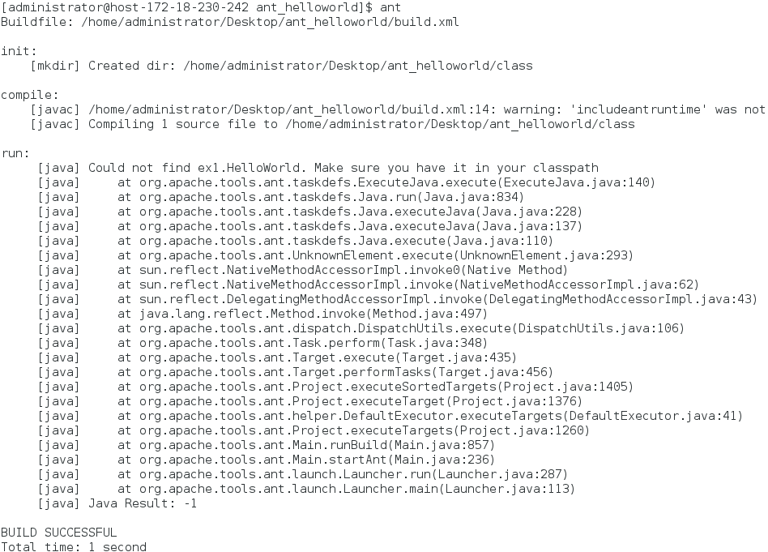

# 任务
## 1.学习vi/vim 编辑器的使用
   1）vi的启动 
      文件存在：进入文件所在目录:cd + 文件目录；vi + 文件名 
      文件不存在：系统会自动创建一个以该字符串命名的文本文件 
      另外以只读模式读取文件： 
  >$ vi –R example.c 以只读方式打开文件
  

  
   2）vi的工作模式 
   3种工作模式：普通模式、编辑模式和命令模式,相互之间可以切换
    
   常用相关命令： 
   >退出：
   >>:wq    文件保存退出 
   >>:q!    强制退出，文件不保存
   
   >编辑文件：
   >>在一般模式输入： 
   >>i(在光标前开始插入文本) 
   >>a(在光标后开始插入文本) 
   >>o(在当前行之下新开一行，并到行首) 

   >
   >光标移动：在一般模式下，hjkl这四个按键就可以移动光标
   >>h (左) j (下) k (上) l (右)
   >
   
   >  删除（可在操作前加数字表示删除多个）： 
  >>x ——删除光标后的一个字符 
  >>X ——删除光标前的一个字符 
  >>dd ——删除光标所在行 
 
>撤销：
>>u ——撤销上一次操作
## 熟悉JDK的环境并学习JAVA语言，完成HelloWorld的编译运行
由于JDK环境已经配置好，直接进行编译运行java程序，程序与步骤如下：

实验步骤及结果

## 熟悉Ant的环境并学习Ant，利用Ant实现HelloWorld的自动编译
   根据TA给的教程配置ant环境变量，基本没什么问题（不过就是考虑下环境变量位置就行）
   >前言:Ant是一个Apache基金会下的跨平台的构件工具，它可以实现项目的自动构建和部署等功能 

   Ant的关键元素：
   ><b>project元素:</b> 
   >project元素是Ant构件文件的根元素，Ant构件文件至少应该包含一个project元素。该元素相关属性：
   >>name属性：
   指定project元素名称
   >>defualt属性：
   指定project默认执行是所执行的target名称。
   >>basedir属性：
   指定基路径的位置。默认使用Ant的构建文件的附目录作为基准目录。
   >                                  

  > <b>target元素：</b> 
  >Ant的基本执行单元，可以包含一个或多个具体任务。
  >相关属性：
  >>name属性：指定target元素名称，具有唯一性 
  >
  >>depends属性：用于描述target之间的依赖关系，若与多个    target存在依赖关系时，需要以“,”间隔.
  >
  >>if属性：验证属性是否存在，不存在target将不会执行。
  >
  >>unless属性：与if相反
  >
  >>description属性：target功能简单描述，可以理解为注释

  利用ant编译helloworld.java文件,build.xml文件内容如下：
   ~~~c
   //build.xml
   <project name="helloworld" default="run" basedir=".">
   // <!--设定变量，之后用。location为文件夹路径-->
	 <property name="src" value="src"/>
	 <property name="class" value="class"/>
    //<!--初始化命令-->     
       <target name = "init">
	 <mkdir dir="${class}"/>
	 </target>
	
	 <path id="classpath">
	  <pathelement path = "${class}"/>
	 </path>
	//编译
	 <target name="compile" depends="init">
  //javac标签用来设置编译程序的参数，srcdir为java文件路 径，destdir为编译后class文件的保存路径
	  <javac srcdir="${src}" destdir="${class}" >
	  </javac>
	 </target>
	//运行java.class
	 <target name="run" depends="compile">
	  <java classname="com.ex1.HelloWorld">
	    <classpath refid ="classpath"></classpath>
	  </java>
 	</target>
 //设定删除命令要删地路径
	 <target name = "clean">
  	  <delete dir="${class}"/>
	 </target>
 ~~~
运行结果：

## 学习Junit，利用Ant、Junit测试通过HelloWorld
   这个没有写完，不知道有没有补交的机会，主要是今天自己电脑上调试jdk变量环境弄了一天，相当于啥都没做。。
