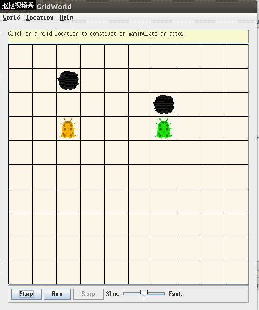
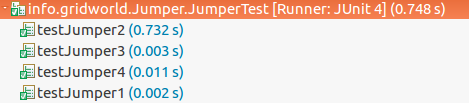

* 首先写下bugRunner测试结果，大致满足条件：
  

* 然后编写JUnit测试文件JumperTest.java，在eclipse上执行。 
  测试条目如下： 
 ~~~java
 @Test //判断正常情况下下一步跳跃情况
  public void testJumper1() {
    ActorWorld world = new ActorWorld();
    Jumper jumper = Jumper();
    world.add(new Location(4, 1), jumper);
    jumper.act();
    assertEquals(2, jumper.getLocation().getRow());
    assertEquals(1, jumper.getLocation().getCol());

  }
 ~~~

 ~~~java
  @Test  //判断前方第二格是否有石头，位置是否改变，以及是否转弯。
  public void testJumper2() {
    ActorWorld world = new ActorWorld();
    Jumper jumper = new Jumper();
    world.add(new Location(2, 1),new Rock());
    world.add(new Location(4, 1), jumper);
    jumper.act();
    assertEquals(4, jumper.getLocation().getRow());
    assertEquals(1, jumper.getLocation().getCol());
    jumper.act();
    assertEquals(4, jumper.getLocation().getRow());
    assertEquals(3, jumper.getLocation().getCol());
  }
 ~~~

 ~~~java
  @Test  //判断前方第二格有Jumper是否避让转弯
  public void testJumper3() {
    ActorWorld world = new ActorWorld();
    Jumper jumper1 = new Jumper();
    Jumper jumper2 = new Jumper();
    world.add(new Location(5, 2), jumper1);
    world.add(new Location(3, 2), jumper2);
    jumper1.act();
    jumper2.act();
    assertEquals(5, jumper1.getLocation().getRow());
    assertEquals(2, jumper1.getLocation().getCol());
    assertEquals(1, jumper2.getLocation().getRow());
    assertEquals(2, jumper2.getLocation().getCol());
  }
  ~~~

  ~~~java
  @Test  //判断前方是否有石头，位置是否改变，以及是否会留下花。
  public void testJumper4() {
    ActorWorld world = new ActorWorld();
    Jumper jumper = new Jumper();
    world.add(new Location(3, 1),new Rock());
    world.add(new Location(4, 1), jumper);
    Grid<Actor> gr = jumper.getGrid();
    Location loc = jumper.getLocation();
    jumper.act();
    assertEquals(2, jumper.getLocation().getRow());
    assertEquals(1, jumper.getLocation().getCol());
    boolean istrue = false;
    if(gr.get(loc) instanceof Flower)
    istrue = true;
    assertEquals(false,istrue);
  }
 ~~~

 测试输出结果： 

 